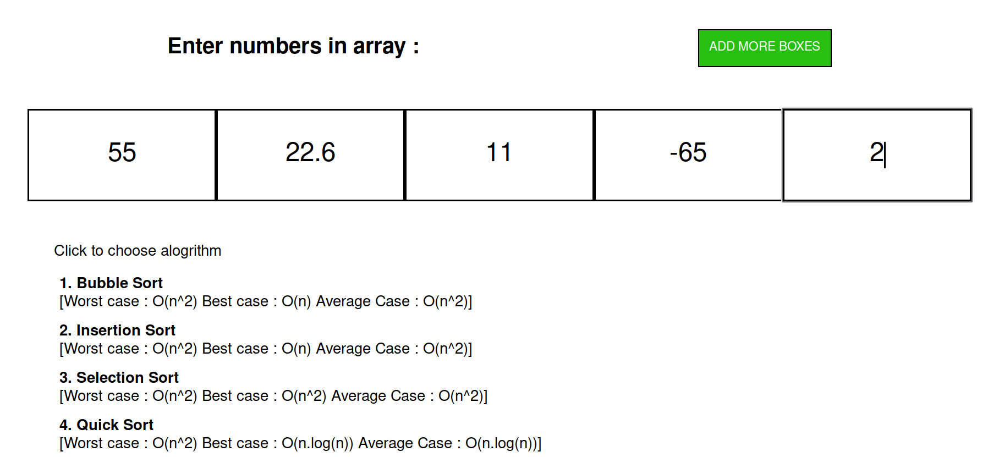
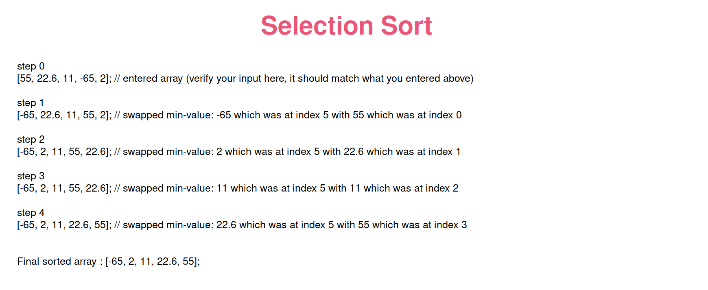
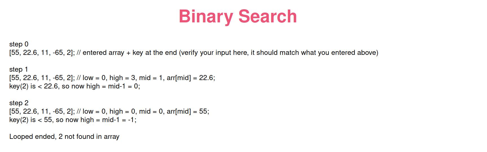
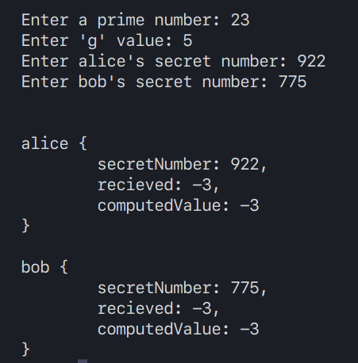
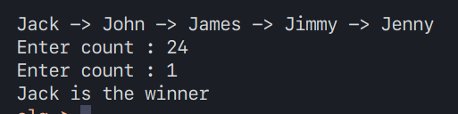
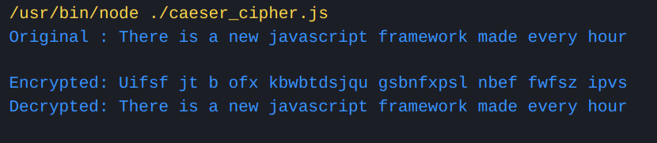
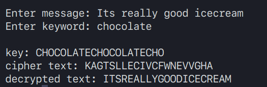
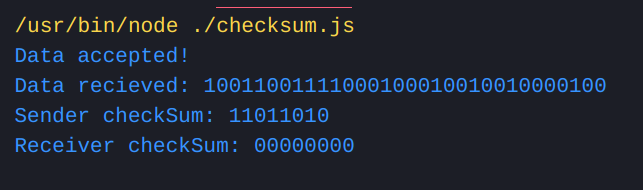
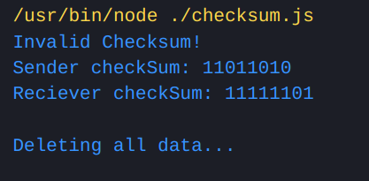

# Miscellaneous stuff

## DSA Cheat Sheet

1. How input is taken
   
    

2. Sorting example
   
    

3. Binary Search example
   
    

## Diffie Hellman

 

## Josephous Problem

 

## Caeser Cipher

 

## Vignere Cipher

## Checksum

1. When checksum matches
    
   

2. When checksum does not match (uncomment `alterFunction()` call)
   
